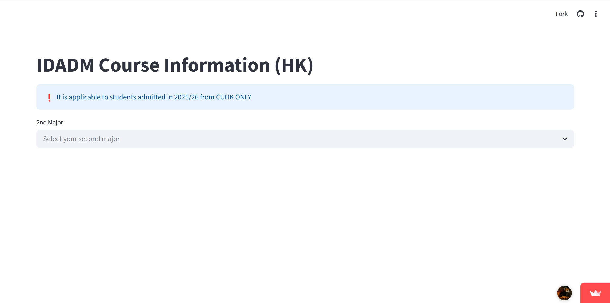
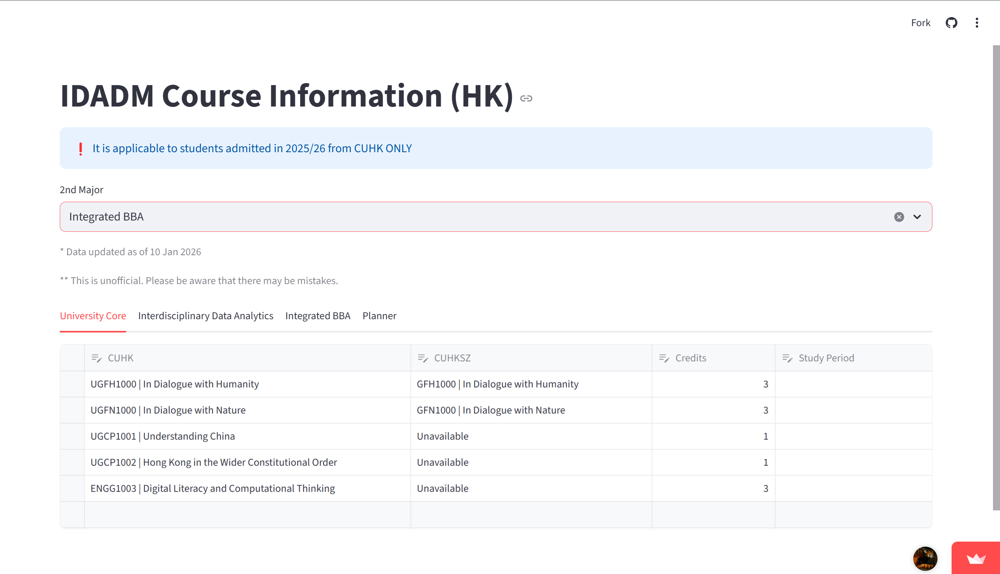

# IDADM Helper

這個項目是用於幫助 2025 入學的 CUHK IDADM（沙田校區）同學進行學業規劃的網頁應用

> [!IMPORTANT]
> 相關資料是基於 2025 入學（沙田校區）的課程 (Courses) 資料。
> 來自其他入學年份 / 校區同學請謹慎使用。如需使用，請留意會否存在差異。

> [!CAUTION]
> 本項目為個人開發項目，並非官方項目，不代表任何組織。
> 由於個人精力有限，無法確保資料的正確性和及時性，資料僅供參考，請多加核查。

## 📖 使用教程

### 🌠 介面




### 🌟 主要特性
- 支持規劃大學必修課程 (University Core)
- 支持規劃 IDADM 課程兩個主修 (Major) 的必修課 (Faculty Package, Required Courses) 和選修課 (Electives)
- 支持計算是否達成課程畢業學分 (Credits) 要求
- 支持計算是否超出學校修讀學分 (Credits) 限制
- 支持導出為 PDF 格式和 Word 格式

## 貢獻

我非常歡迎對項目的貢獻，您可以通過以下方式貢獻：

- **提交 Issue**: 報告 Bug 或提出新功能建議。
- **提交 Pull Request**: 直接提交代碼優化。
- **完善文檔**: 改進使用說明或翻譯。
- **分享反饋**: 告訴你的同學，幫助更多人。

### 本地部署

``` bash
`git clone https://github.com/yourusername/IDADM-Helper.git`
`cd IDADM-Helper`
`pip install -r requirements.txt`
`streamlit run main.py`
```


## 📄 許可證 (License)
本項目採用 [MIT License](LICENSE) 許可。