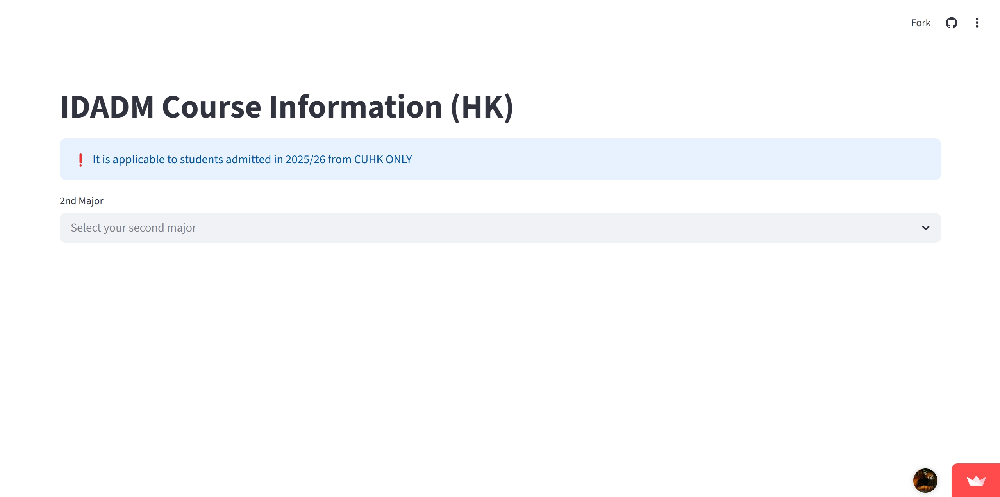
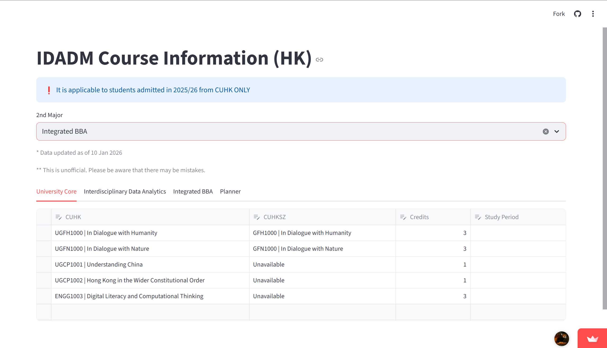
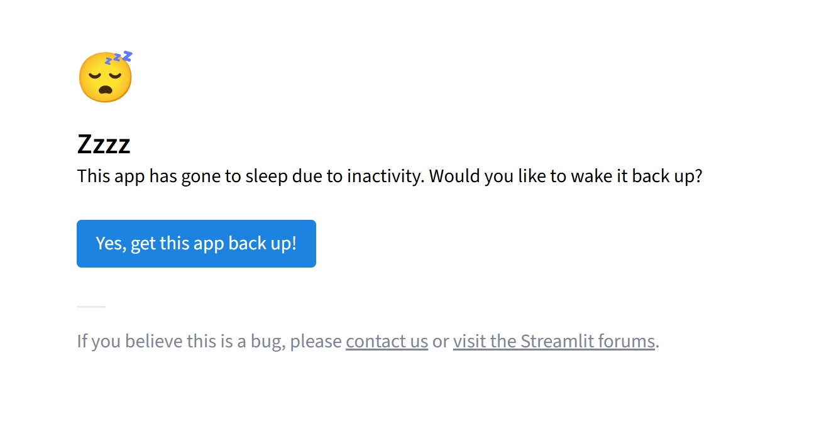

# IDADM Course Helper

這個項目是用於幫助 2025 入學的 CUHK IDADM（沙田校區）同學進行學業規劃的網頁應用

> [!IMPORTANT]
> 相關資料是基於 2025 入學（沙田校區）的課程資料。
>
> 來自其他入學年份 / 校區同學請謹慎使用。如需使用，請留意資料會否存在差異。

> [!CAUTION]
> 本項目為個人開發項目，並非官方項目，不代表任何組織。
> 
> 由於個人精力有限，無法確保資料的正確性和及時性，資料僅供參考，請多加核查。

## 📖 使用教程

### 🌠 介面





> [!IMPORTANT]
> 打開網頁如果遇到 `This app has gone to sleep due to inactivity. Would you like to wake it back up?`，請點擊 `Yes, get this app back up!` 按鈕。
>
> 
>
> 這是因為資源所限，所使用的免費網頁托管平台設有自動休眠機制，當網頁未被訪問超過一段時間後，會自動休眠。


### 🌟 主要特性
- 支持規劃大學必修課程 (University Core)
- 支持規劃 IDADM 課程兩個主修 (Major) 的必修課 (Faculty Package, Required Courses) 和選修課 (Electives)
- 支持從成績單截圖 / PDF **批量導入**已修課程（需配置 LLM API Key）
- 新增**中英文語文要求**（Chinese Language / English Language）課程清單，並在 Planner 自動核算達成情況
- 支持計算是否達成課程畢業學分 (Credits) 要求
- 支持計算是否超出學校修讀學分 (Credits) 限制
- 支持導出為 PDF 格式和 Word 格式

### 使用教程
詳見 [User Guide](docs/user_guide.md)

## 貢獻

我非常歡迎對項目的貢獻，您可以通過以下方式貢獻：

- **提交 Issue**: 報告 Bug 或提出新功能建議。
- **提交 Pull Request**: 直接提交代碼優化。
- **完善文檔**: 改進使用說明或翻譯。
- **分享反饋**: 告訴你的同學，幫助更多人。

### 本地部署

本專案使用 [uv](https://github.com/astral-sh/uv) 管理依賴（Python 3.14），請先安裝 uv。

```bash
git clone https://github.com/yourusername/IDADM-Helper.git
cd IDADM-Helper
uv sync               # 依據 pyproject.toml / uv.lock 安裝依賴
uv run streamlit run main.py
```

> [!IMPORTANT]
> 應用需要 Supabase 憑證才能啟動。請在本地建立 `.streamlit/secrets.toml` 並填入（本倉庫已附 `.streamlit/secrets.example` 範本，複製後填入即可：`cp .streamlit/secrets.example .streamlit/secrets.toml`）：
> ```toml
> SUPABASE_URL = "https://xxxx.supabase.co"
> SUPABASE_KEY = "eyJxxxx"
> ```
> 該文件已列入 `.gitignore`，請勿提交。

> [!NOTE]
> 若想使用**課程導入**（v1.1）功能，需額外配置視覺語言模型的憑證（OpenAI 兼容端點）：
> ```toml
> LLM_API_KEY = "sk-xxxx"                       # 課程導入功能所需，必填
> LLM_BASE_URL = "https://your-endpoint/v1"     # 可選，自託管 / 代理端點
> COURSE_IMPORT_MODEL = "gemini-3.5-flash-lite" # 可選，預設模型
> ```
> 未配置 `LLM_API_KEY` 時，匯入功能會提示金鑰缺失而不影響其他功能。


## Docker 部署

本專案提供 `Dockerfile`、`docker-compose.yml` 與 `.dockerignore`，可將整個應用打包為容器，部署至任何支援 Docker 的伺服器（包含 1Panel 等管理面板）。鏡像使用 `uv` 官方基礎鏡像（Python 3.14），依賴由 `uv.lock` 鎖定。

### 前置準備

- 伺服器已安裝 Docker 與 Docker Compose v2。
- 準備 Supabase 密鑰文件 `.streamlit/secrets.toml`（本倉庫已附 `.streamlit/secrets.example` 範本，複製後填入即可：`cp .streamlit/secrets.example .streamlit/secrets.toml`）：

  ```toml
  SUPABASE_URL = "https://xxxx.supabase.co"
  SUPABASE_KEY = "eyJxxxx"
  LLM_API_KEY = "sk-xxxx"                       # 課程導入功能所需，必填
  LLM_BASE_URL = "https://your-endpoint/v1"     # 可選，自託管 / 代理端點
  COURSE_IMPORT_MODEL = "gemini-3.5-flash-lite" # 可選，預設模型
  ```

> [!CAUTION]
> 此文件包含敏感憑證，**請勿提交到 Git**（`.dockerignore` 已將其排除，不會被打入鏡像）。部署時以 volume 掛載方式載入。

### 部署步驟

1. 將項目上傳至伺服器（例如 `/opt/idadm`），目錄需包含 `Dockerfile`、`docker-compose.yml`、`pyproject.toml`、`uv.lock`、`main.py`、`app/`、`src/`、`data/`。
2. 在該目錄下建立 `.streamlit/secrets.toml` 並填入密鑰。
3. 執行：

   ```bash
   docker compose up -d --build
   ```

4. 瀏覽器訪問 `http://伺服器IP:8501`。

### 使用 1Panel 部署

若伺服器以 1Panel 管理：

1. 於「文件」模塊上傳並解壓項目到 `/opt/idadm`。
2. 「容器 → 編排 → 創建編排」，來源選 **「路徑選擇」** 並指向 `/opt/idadm`（請勿使用「編排」貼上模式，否則 build 上下文會錯誤）。
   > [!IMPORTANT]
   > 本專案的 `docker-compose.yml` 刻意**移除了 `image:` 欄位**。若自行加上 `image: xxx:latest`，1Panel 會先嘗試從倉庫 `pull` 該鏡像而報 `pull access denied`，應僅保留 `build: .` 由本地構建。
3. 啟動後即可在「容器」中看到名為 `idadm` 的容器運行，監聽埠 `8501`。

### 更新應用

修改代碼後：

1. 將變更文件覆蓋上傳至 `/opt/idadm`（保持 `.streamlit/secrets.toml` 不變）。
2. 重新構建並啟動：

   ```bash
   cd /opt/idadm
   docker compose build
   docker compose up -d
   ```

Docker 會利用層級快取：僅修改應用邏輯（`app/`、`src/`、`main.py`、`data/`）時重建只需數秒；唯有更動 `pyproject.toml` / `uv.lock` 才會重新安裝依賴。

## 📄 許可證 (License)
本項目採用 [MIT License](LICENSE) 許可。
