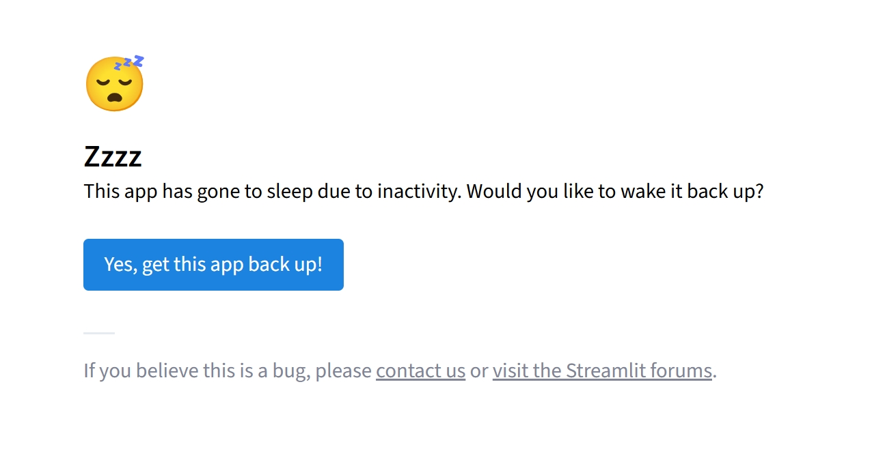

# IDADM Course Helper 使用指南 📘

歡迎使用 **IDADM Course Helper**！本指南將幫助你快速上手，高效規劃你的大學學業。

---
> [!IMPORTANT]
> 打開網頁如果遇到 `This app has gone to sleep due to inactivity. Would you like to wake it back up?`，請點擊 `Yes, get this app back up!` 按鈕。
>
> 
>
> 這是因為資源所限，所使用的免費網頁托管平台設有自動休眠機制，當網頁未被訪問超過一段時間後，會自動休眠。

## 1. 初始設定

打開應用後，你首先需要選擇你的 **第二主修 (2nd Major)**。

- 在頁面頂部的下拉選單中選擇你的專業 (Major)。
- 系統會根據你的選擇，自動載入該專業的必修課 (Required Courses) 和選修課 (Electives) 要求。

> [!TIP]
>
> 必須先選擇第二主修 (2nd Major)，後續的課程規劃選項卡才會顯示。

## 2. 課程規劃流程

應用界面分為四個主要標籤頁 (Tab)，建議按以下順序進行規劃：

### 第一步：規劃大學必修課 (University Core)
在 **"University Core"** 標籤頁 (Tab) 中：
- 你會看到所有大學必修課列表（如中文、英文、通識等）。
- 在 **"Study Period"** 列中，為每門課選擇你打算修讀的學期 (Semester)（例如：`Year 1 Sem 1`）。

> [!Note]
>
> 由於我們可以在暑期學期同時在 CUHK 和 CUHK(SZ) 修讀課程，因此在選擇學期時，請注意校區分別。
- **手動添加**：如果需要添加額外的課程（如特定的通識選修），可以使用表格下方的添加行功能。

> [!IMPORTANT]
>
> 大學必修課程由於課程繁多，難以列舉，所以請自行添加課程資料。
>
> 添加時請注意所填寫的校區欄位，確保與修讀的校區相符。

### 第二步：規劃第一主修 (IDA)
在 **"Interdisciplinary Data Analytics"** 標籤頁 (Tab) 中：
- 規劃你的 **Faculty Package**、**Required Courses** 和 **COOP** 課程。
- **選修課規劃**：從 Group A 和 Group B 中選擇課程。系統會自動計算你是否滿足「至少 12 學分 (Credits) 3000 級或以上課程（含 6 學分 4000 級）」的特殊要求。

> [!IMPORTANT]
>
> 為方便計算畢業要求，請優先在 Faculty Package 和 Required Courses 選擇課程。
> 
> 因為計算畢業要求是根據你在選擇區域所代表的類別計算。
> 
> > 假如你第一主修 (1st Major) 有一門課，且你的第二主修 (2nd Major) 也有這門課。
> > 

### 第三步：規劃第二主修
在以你選擇的 **專業 (Major) 名稱命名的標籤頁 (Tab)** 中：
- 重覆第二步規劃該專業的必修課 (Required Courses)、研究項目 (Research Component) 和選修課 (Electives)。

---

## 3. 進度檢查與監控

所有課程規劃完成後，點擊 **"Planner"** 標籤頁 (Tab) 進行詳細檢查：

### 學期視圖 (Year 1 - Year 4)
- **實時學分 (Credits) 計算**：查看每個學期 (Semester) 已選課程的總學分。
- **學分 (Credits) 限制提醒**：
  - **常規學期**：9 - 18 學分 (Credits)（一年級學分上限為 19）。
  - **暑假學期 (Summer Term)**：上限 6 學分 (Credits)。
  - **全學年**：18 - 39 學分 (Credits)。
  - 如果超出或低於限制，系統會彈出**紅色提醒**，提醒你需要提交超修/減修申請。

### 畢業要求檢查 (Graduation Requirements)
- 在 **"Graduation Requirements"** 子標籤頁 (Sub-Tab) 中，你可以直觀地看到：
  - 各個課程類別（UCore, 1st Major, 2nd Major）的學分 (Credits) 達成情況。
  - 哪些要求已符合，哪些仍未足夠。

> [!IMPORTANT]
> 由於無法儘列大學必修課程，因此大學必修課程的達成情況需要手動調整。

> [!IMPORTANT]
>
> 畢業要求檢查僅基於目前選課情況，不代表實際畢業要求。

---

## 4. 導出文件

在 **"Planner" -> "Overall"** 標籤頁 (Tab) 中：

- **預覽總表**：查看課程的排期表。
- **導出文件**：
  - 點擊 **"Export as PDF"**：導出為 PDF 文件。
  - 點擊 **"Export as Word"**：導出為 `.docx` 文件。

---

## 💡 注意事項
- **數據安全**：應用基於 Streamlit 運行，在當前會話中你的選擇會自動保留，但刷新頁面可能會導致重置。建議規劃完成後及時導出。
> [!CAUTION]
>
> 由於資源和精力有限，目前暫不支持導入功能、雲端存儲功能。
>
> 因此網頁一旦關閉，所有數據便會消失，敬請留意。

- **官方參考**：本工具僅供參考，請查閱 CUSIS / SIS 等官方系統和[課程官網](https://www.idadm.cdmp.cuhk.edu.hk/)。

---
*祝你在 IDADM 的學習旅程一帆風順！*

> [!NOTE]
>
> 本文使用 AI 自動撰寫，經人工修改。
